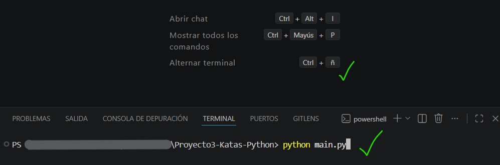
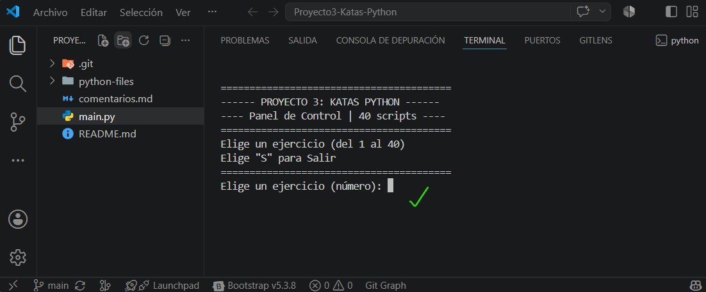

# Indicaciones para el Proyecto 3

## Katas Python

Este **tercer proyecto** consiste en completar, validar y entregar **todos los ejercicios de Python** que os planteamos a continuación.

Una vez terminado tendréis que enviar el proyecto a `antonio.rosales@thepower.education` con el asunto **Proyecto 3: Katas Python - Vuestro nombre** y en el cuerpo del correo el **link** de un **repositorio de GitHub**.

### ¿Cómo enfocar las katas?

Las katas pueden hacerse de distintas maneras para obtener el mismo resultado. A lo largo del proyecto debes demostrar los siguientes conocimientos:

- Manejo de tipos de datos básicos y funciones incorporadas.
- Manejo de estructuras de datos en Python y sus métodos.
- Manejo de condicionales.
- Manejo de estructuras de iteración
- Manejo de funciones en Python.
- Manejo de Clases y entendimiento de la programación orientada a objetos.
- Uso de módulos.
- Buenas prácticas.

> ❗️ Es importante que demuestres un entendimiento de tu código, recuerda poner comentarios explicativos de los pasos que más te hayan costado.
>
> ❗️❗️ El uso de herramientas de **IA** está permitido pero recuerda que este proyecto está pensado para que afiances tus conocimientos en **Python**, asegúrate de usar estás herramientas con moderación y de que entiendes todos los pasos que has seguido.

### Método de entrega

Tu repositorio tiene que constar, al menos, de los siguientes archivos/carpetas:

- **Comentarios** que recojan los pasos seguidos durante el proyecto.
- **Un archivo .py** con los ejercicios resueltos.
- Cada ejercicio tiene que ir encabezado con un comentario con el enunciado del ejercicio.

---

### PROPUESTA DE DESARROLLO: Estructura para la entrega

Repositorio preparado y listo para la entrega del **Proyecto 3: Katas Python** del Máster, _by Antonio Rosales_.

En este proyecto se encontrará la resolución de **40 ejercicios de programación en Python**, abarcando desde conceptos fundamentales, hasta estructuras de datos, funciones y modularización.

Además, decidí incluir para el proyecto, un archivo `main.py` que hace de **ejecutable principal**, el cual permite elegir y ejecutar cada ejercicio de forma interactiva, con el objetivo de facilitar la corrección y evaluación.

```bash
📂 Proyecto3-Katas-Python   # nombre del repositorio principal
├── 📂 python-files/        # Carpeta con todos los módulos (ejercicios)
│   ├── 📄 __init__.py      # archivo que enlaza los módulos (ejercicios) al menú
│   ├── 📄 ejercicio_01.py
│   ├── 📄 ejercicio_02.py
│   ├── 📄 ejercicio_03.py
│   ├── ...
│   └── 📄 ejercicio_40.py
├── comentarios.md          # Interacción progresiva de los pasos seguidos
├── main.py                 # Panel interactivo para ejecutar los ejercicios
└── README.md               # Indicaciones del proyecto (este mismo)
```

### Pasos previos para la ejecución correcta

#### En Windows 🪟

```bash
# Escribiremos en el CMD (terminal)
python --version

# Si no lo tenemos, instalamos Python 3 siguiendo los pasos:
# Abre el navegador y descarga el ejecutable desde python.org, luego ejecuta
# el instalador y asegurate de marcar "Add Python to PATH" antes de instalar.

# Ejecutar el script desde el terminal.
python main.py

# También se puede ejecutar individualmente (opcional)
python python-files/ejercicio_01.py
```

#### En Linux 🐧

```bash
# Abrimos el Terminal (Ctrl + Alt + T) en tu Linux y escribimos:
python --version

# Por lo general viene siempre pre-instalado Python en Linux

# Ejecutar el script en el terminal
python3 main.py
```

---

> **NOTA:** También es posible ejecutarlo en el mismo **Visual Studio Code**, abriendo un terminal (**CTRL + ñ**) en la carpeta principal del repositorio y ejecutar `python main.py` o `python3 main.py` tal y como se muestra en la siguiente imagen. 👇



> Debería mostrarse así:



---

### Entorno de Desarrollo

- **Lenguaje:** Python 3.x
- **Editor:** Visual Studio Code
- **Control de Versiones:** Git & GitHub
- **Sistema Operativo:** Windows / Ubuntu
